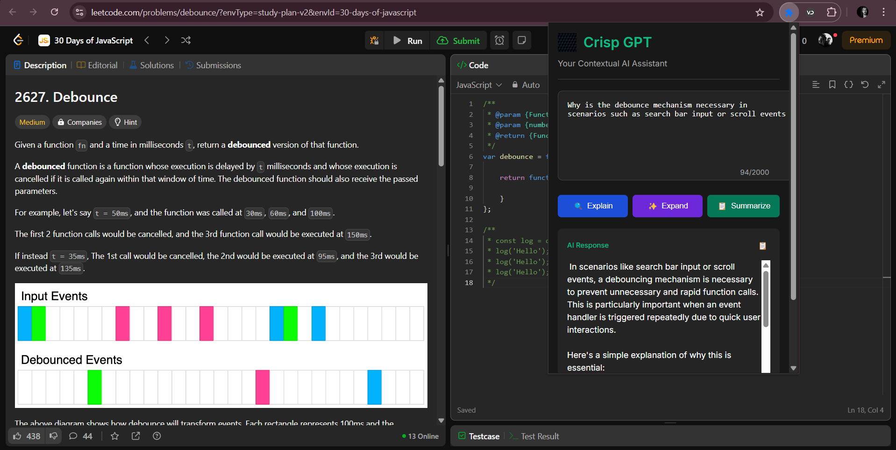

# CRISP GPT Chrome Extension 

[](https://opensource.org/licenses/MIT)
[](https://developer.chrome.com/docs/webstore)

A powerful AI assistant Chrome extension with Mistral AI integration for text explanation, expansion, and summarization. Works with local AI models via Ollama and cloud services.



## Features ✨


- **Text Processing Actions**
  - 🔍 Explain technical concepts in simple terms
  - ✨ Expand ideas with examples and details
  - 📋 Summarize long content to key points
  - 🗑️ Auto-cleanup of temporary elements

- **Advanced Integration**
  - Local AI processing with Mistral via Ollama
  - MongoDB caching system for frequent queries
  - Multi-service architecture with Express backend
  - Secure API key management

## Tech Stack 🛠️

### Frontend (Extension)

- **Core**
  - Chrome Extension Manifest V3
  - HTML5 Semantic Markup
  - CSS3 with Flexbox/Grid layouts
  - Modern JavaScript (ES6+)

### Backend Service
- **Runtime**
  - Node.js v18+ (LTS)
  - Express.js 4.x web framework

- **AI Integration**
  - Mistral 7B via Ollama (local)
  - REST API endpoints
  - Axios for HTTP requests

- **Database**
  - MongoDB Atlas (Cloud)
  - Mongoose ODM
  - TTL Indexes for auto-expiry

### Development Tools
- Build System
  - Webpack 5 (Module bundler)
  - Babel (ES6+ Transpiler)
  
- Code Quality
  - ESLint (Airbnb config)
  - Prettier (Code formatting)
  - npm scripts automation

- Testing
  - Jest (Unit testing)
  - Puppeteer (E2E testing)

## Installation 💻

### Prerequisites
- Chrome Browser (v115+)
- Node.js v18+ & npm v9+
- MongoDB Atlas account
- Ollama installed locally

### Setup Steps

1. **Clone Repository**
```bash
git clone https://github.com/dushyant4665/CRISP_GPT_chrome_extension.git
cd CRISP_GPT_chrome_extension
